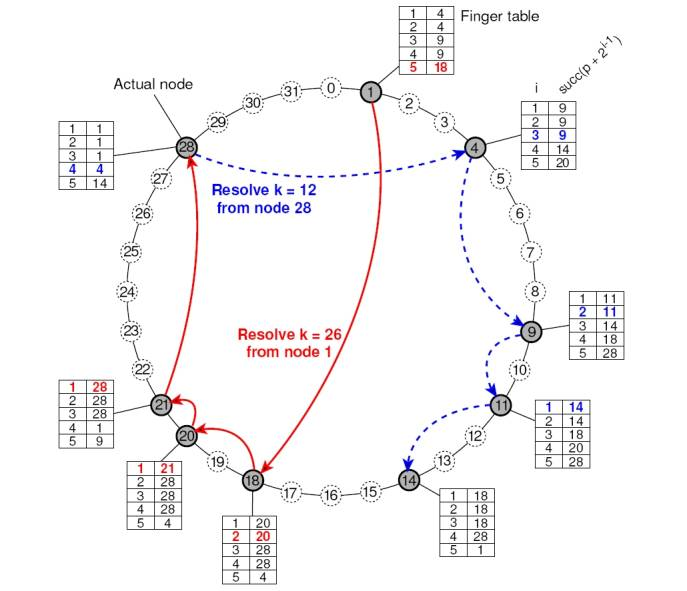
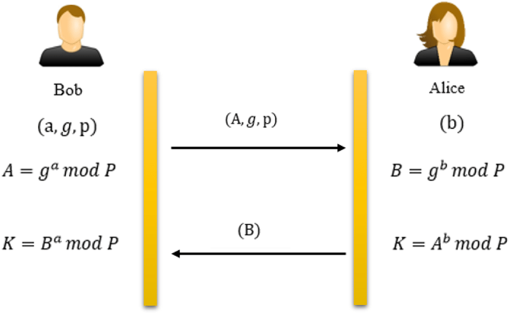

# Algorithms for Distributed Systems

## Table of Contents
1. [Berkeley](#berkeley)
2. [Chord System](#chordSystem)
3. [Crypto System](#cryptoSystem)
4. [Diffie Hellman](#diffieHellman)
5. [Greedy Server Placement](#greedyServerPlacement)
6. [Lamport's Logical Clocks](#lamportsLogicalClocks)
7. [Read Write Quorums](#readWriteQuorums)
8. [Vector Clock](#vectorClock)

## [Berkeley](https://github.com/ukalto/VSVO-Algorithms/blob/master/Berkeley.py)

<a name="berkeley"/>

(<a href="#readme-top">Back to Top</a>)

## [Chord System](https://github.com/ukalto/VSVO-Algorithms/blob/master/ChordSystem.py)

<a name="chordSystem"/>

In computing, Chord is a protocol and algorithm for a peer-to-peer distributed hash table. 
A distributed hash table stores key-value pairs by assigning keys to different computers (known as "nodes"); 
a node will store the values for all the keys for which it is responsible. 
Chord specifies how keys are assigned to nodes, and how a node can discover the value for a given key by first locating the node responsible for that key.

### How to use?

<ol>
    <li>Start the ChordSystem.py program</li>
    <li>First you have to type in the amount of nodes which is saved in <b>"nodes_length"</b> (In the given Example it would be 32)</li>
    <li>Secondly you have to add the <b>"bid_id"</b> which is the bit identifier (In the given example it is represented by the length of each finger table which is 5)</li>
    <li>The first two steps are to create a working <b>Chord System</b>, however if you want to find a path from one node to another with a key the next two steps have to be typed in as well (If you don't want to create a path just let the <b>"start_node"</b> and <b>"key"</b> free by just pressing enter)</li>
    <li>If you want to create a path just type in the <b>"start_node"</b> and the <b>"key"</b> (In the given example one case would be k=12 and start_node=28</li>
</ol>

### Example:

(Source: [Reddit](https://www.google.com/url?sa=i&url=https%3A%2F%2Fwww.reddit.com%2Fr%2Flearnprogramming%2Fcomments%2F38463v%2Fchord_distributed_system%2F&psig=AOvVaw31DQxb1fsH8an0z24vIlol&ust=1683488243687000&source=images&cd=vfe&ved=0CBEQjRxqFwoTCKD78sW44f4CFQAAAAAdAAAAABAS))

(<a href="#readme-top">Back to Top</a>)

## [Crypto System](https://github.com/ukalto/VSVO-Algorithms/blob/master/CryptoSystem.py)

<a name="cryptoSystem"/>

(<a href="#readme-top">Back to Top</a>)

## [Diffie Hellman](https://github.com/ukalto/VSVO-Algorithms/blob/master/DiffieHellman.py)

<a name="diffieHellman"/>

Diffie–Hellman key exchange is a mathematical method of securely exchanging cryptographic keys over a public channel and was one of the first public-key 
protocols as conceived.
### How to use?

<ol>
    <li>Start the DiffieHellman.py program</li>
    <li>Type in the <b>modulo value n</b> (in the example n is P)</li>
    <li>Type in the <b>base value g</b></li>
    <li>Type in the <b>a value</b></li>
    <li>Type in the <b>b value</b></li>
</ol>

### Example:

(Source: [Reasearch Gate](https://www.researchgate.net/figure/Diffie-Hellman-Key-exchange-protocol_fig5_350590914))

(<a href="#readme-top">Back to Top</a>)

## [Greedy Server Placement](https://github.com/ukalto/VSVO-Algorithms/blob/master/GreedyServerPlacement.py)

<a name="greedyServerPlacement"/>

(<a href="#readme-top">Back to Top</a>)

## [Lamport's Logical Clocks](https://github.com/ukalto/VSVO-Algorithms/blob/master/LamportsLogicalClocks.py)

<a name="lamportsLogicalClocks"/>

The Lamport timestamp algorithm is a simple logical clock algorithm used to determine the order of events in a distributed computer system. 
As different nodes or processes will typically not be perfectly synchronized, this algorithm is used to provide a partial ordering of events with minimal overhead, 
and conceptually provide a starting point for the more advanced vector clock method.

### How to use?

<ol>
    <li>The first step is to fill in all messages by adapting the <b>"messages" array</b> in the LamportsLogicalClocks.py file (In the given example it would look like this <b>messages = [[1,2,2],[2,3,3],[2,1,6],[3,2,7]]</b>) 
        <ol>
            <li>case: [1,2,2]</li> 
            <li>The first number represents from which processor we are sending the message, the range is 1-processors, which in this case is P1(1)</li>
            <li>The second number represents to which processor we are sending the message, the range is 1-processors, which in this case is P2(2)</li> 
            <li>The third number represents the row we are sending the number from the first given process, which in this case is 2</li>
        </ol>
    </li>
    <li>Start the LamportsLogicalClocks.py program</li>
    <li>First you have to type in the amount of processors existing, which in this case would be 3</li>
    <li>Secondly you have to type in the amount of rows existing, which in this case would be 9</li>
    <li>Lastly just type in the number sequences for each processor, which in this case would be 5,8,10</li>
</ol>

### Example:

(Source: [Thomas Wiki](https://www.google.com/url?sa=i&url=https%3A%2F%2Felsensohn.ch%2Fen%2Fdocs%2Fdistributed-systems%2Fclock-synchronization%2F&psig=AOvVaw3qZDXpFOMRwZhdH6ZI-P5v&ust=1683491016176000&source=images&cd=vfe&ved=0CBEQjRxqFwoTCIDli_LC4f4CFQAAAAAdAAAAABAK))

(<a href="#readme-top">Back to Top</a>)

## [Read Write Quorums](https://github.com/ukalto/VSVO-Algorithms/blob/master/ReadWriteQuorums.py)

<a name="readWriteQuorums"/>

Read-write quorums define two configurable parameters, R and W. 
R is the minimum number of nodes that must participate in a read operation, and W the minimum number of nodes that must participate in a write operation.
There are 2 main rules included in the system:
<ol>
    <li>It is a read quorum (read is important)</li>
    <ol>
        <li>The read part is <b>1</b> and the write part is <b>n</b></li>
    </ol>
    <li>Otherwise</li>
    <ol>
        <li>The write part is calculated as following: random number between <b>n/2 && n</b></li>
        <li>The read part is calculated as following: random number between <b>n - writeQuorum + 1 && n</b></li>
    </ol>
</ol>

### How to use?

<ol>
    <li>Start the ReadWriteQuorums.py program</li>
    <li>First enter the amount of numbers existing which is represented in the variable <b>n</b>, which in the example would be <b>12</b></li>
    <li>Secondly type in "1" if reading is important, if not just type in any other value</li>
</ol>

### Example:

(Source: [Lass](https://lass.cs.umass.edu/~shenoy/courses/spring22/lectures/Lec17_notes.pdf))

(<a href="#readme-top">Back to Top</a>)

## [Vector Clock](https://github.com/ukalto/VSVO-Algorithms/blob/master/VectorClock.py)

<a id="vectorClock"/>

(<a href="#readme-top">Back to Top</a>)

